# Lapres Jarkom-Modul-1-2026-K-35

# Daftar Isi

- [Lapres Jarkom-Modul-1-2026-K-35](#lapres-jarkom-modul-1-2026-k-35)
  - [Data Kelompok & IP Setup](#ip-address-host--10489247)
- [Serial Experiments Lain](#serial-experiments-lain)
  - [Soal 1: Topologi Jaringan](#soal_1)
  - [Soal 2: Konfigurasi Router Lain ke Internet (NAT/DHCP)](#soal_2)
  - [Soal 3: Konfigurasi Routing & Static IP Client](#soal_3)
  - [Soal 4: Firewall, NAT Masquerade & DNS Resolver](#soal_4)
  - [Soal 5: Persistensi Konfigurasi & Script Verifikasi](#soal_5)
  - [Soal 6: Packet Sniffing pada Anomali Traffic](#soal_6)
  - [Soal 7: FTP Server Menggunakan vsFTPd](#soal_7)
  - [Soal 8: Koneksi FTP Client dari User Lainnya](#soal_8)
  - [Soal 9: Pengujian Akses Read-Only](#soal_9)
  - [Soal 10: Uji Ketahanan Koneksi Jaringan The Wired](#soal_10)
  - [Soal 11: Pembuktian Kelemahan Protokol Telnet](#soal_11)
  - [Soal 12: Analisis Perbedaan Port Terbuka dan Tertutup pada TCP FLag](#soal_12)
  - [Soal 13: Koneksi OpenSSH dan Identifikasi](#soal_13)
  - [Soal 14: Analisis Serangan Brute-Force](#soal_14)
  - [Soal 15: Analisis Perangkat Keyboard USB](#soal_15)
  - [Soal 16: Analisis Lalu Lintas FTP](#soal_16)
  - [Soal 17: Analisis Payload pada Sistem](#soal_17)
  - [Soal 18: Analisis Menggunakan Protokol SMB](#soal_18)
  - [Soal 19: Analisis Email Pemerasan pada Protokol SMTP](#soal_19)
  - [Soal 20: Analisis Lalu Lintas Malware](#soal_20)

| Nama | NRP |
| ---------------------- | ---------- |
| Dea Chrisna Butarbutar | 5027241035 |
| Pradipta Airlangga Ramadhan | 5027241118 |
----


# IP Address Host : 10.4.89.247

# IP Prefix : 10.81.x.x

# Serial Experiments Lain

## Soal_1

Untuk mempersiapkan pembangunan The Wired, Lain yang berperan
sebagai Router membuat tiga Switch/Gateway: Switch 1 menuju dua
Entitas yaitu Alice dan Mika, Switch 2 menuju Chisa, sedangkan Switch 3
menuju Knights dan Eiri. Kelima Entitas tersebut dikonfigurasi sebagai
Client di GNS3.

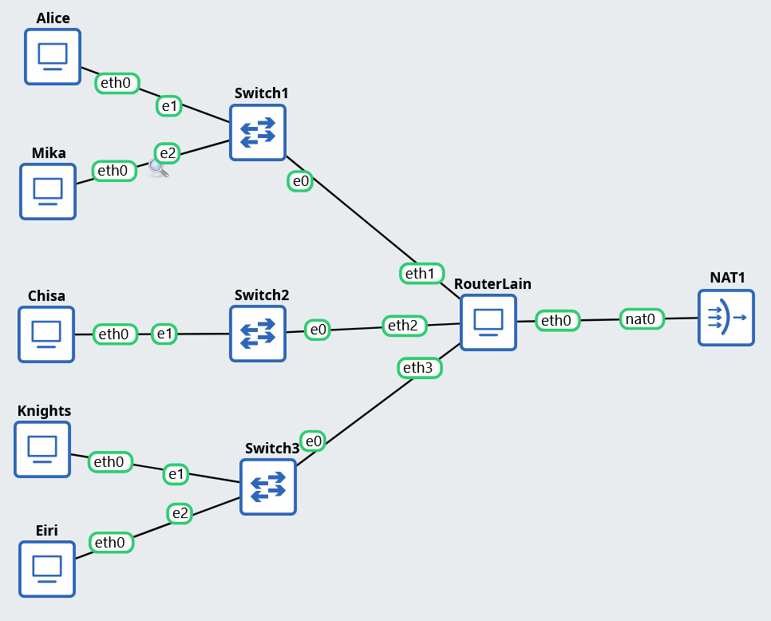

Kami membuat topologi jaringan sesuai dengan intruksi soal

Syarat:
- NAT : Sebagai dynamic IP DHCP dan bisa terkoneksi ke internet.
-RouterLain : Sebagai networking yang terhubung dengan NAT.
- Switch 1 dan 2 dan 3 : Sebagai gateway client yang terkoneksi ke internet.
- Client (Alice, Mika, Chisa, Knights, Eiri) : Client yang terhubung dalam topologi jaringan

## Soal_2
Karena menurut Lain pada saat itu The Wired masih terisolasi dari
dunia luar, konfigurasikan router Lain agar dapat tersambung
langsung ke jaringan internet publik melalui NAT/DHCP pada interface
eth0.

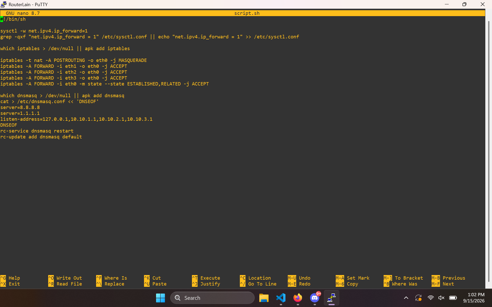

```
#!?bin/sh
auto eth0
iface eth0 inet dhcp

auto eth1
iface eth1 inet static
    address 10.81.1.1
    netmask 255.255.255.0

auto eth2
iface eth2 inet static
    address 10.81.2.1
    netmask 255.255.255.0

auto eth3
iface eth3 inet static
    address 10.81.3.1
    netmask 255.255.255.0
EOF

rc-update add networking boot
rc-service networking restart
```

Agar RouterLain dapat terkoneksi kita melakukan interface RouterLain yang terhubung ke NAT untuk mendapat IP DHCP, dengan configurasi yang dimasukkan /root/script.sh

```
auto eth0
iface eth0 inet dhcp
```
Ini untuk melakukan setup interface eth0 yang terhubung ke NAT mendapatkan alamat IP dari DHCP tersebut

## Soal_3
Setelah router Lain terhubung ke internet, pastikan seluruh Entitas
(Client) di bawah Switch 1, Switch 2, dan Switch 3 dapat saling
terhubung dan berkomunikasi satu sama lain melalui konfigurasi
routing.

Karena switch terhubung dengan RouterLain, maka konfigurasi interface router kita buat terhubung ke switch 1, 2, 3, dengan konfigurasi:

```
auto eth1
iface eth1 inet static
    address 10.81.1.1
    netmask 255.255.255.0

auto eth2
iface eth2 inet static
    address 10.81.2.1
    netmask 255.255.255.0

auto eth3
iface eth3 inet static
    address 10.81.3.1
    netmask 255.255.255.0
```
Prefix kelompok kami adalah 10.81.x.x

Selanjutnya kami mengecek interface apakah memiliki IP yang benar atau salah, degan menggunakan ip adrr show

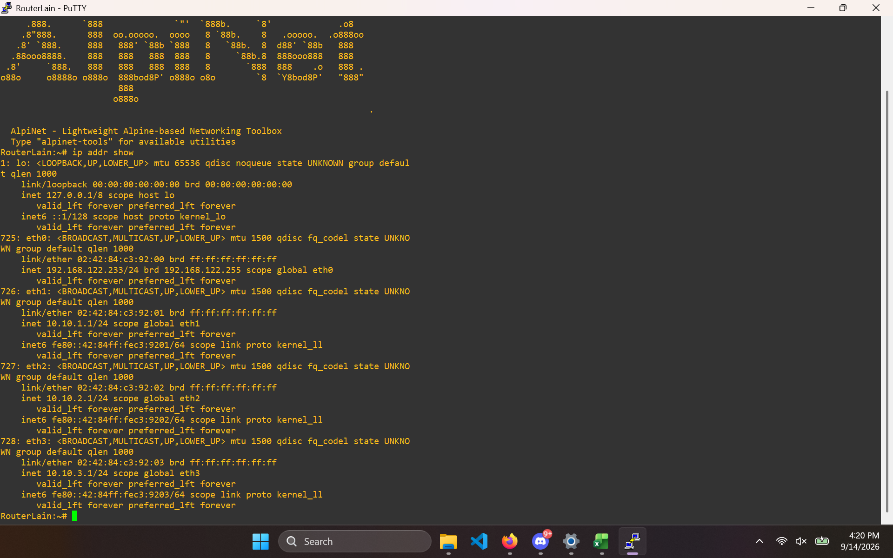

 Pada gambar ini, sudah jelas interface memiliki IP yang sesuai dengan apa yang sudah dikonfigurasikan

Lalu, kita buat tiap client memiliki alokasi IP sendiri, yaitu degan melakukan konfigurasi static ip di tiap client dan juga gateway dibuat spesifik sesuai dengan switch dari tiap client tersebut terhubung. 

Alice
```
auto eth0
iface eth0 inet static
    address 10.81.1.10
    netmask 255.255.255.0
    gateway 10.81.1.1
```

Mika
```
auto eth0
iface eth0 inet static
    address 10.81.1.11
    netmask 255.255.255.0
    gateway 10.81.1.1
```

Chisa
```
auto eth0
iface eth0 inet static
    address 10.81.2.10
    netmask 255.255.255.0
    gateway 10.81.2.1
```
Knights
```
auto eth0
iface eth0 inet static
    address 10.81.3.10
    netmask 255.255.255.0
    gateway 10.81.3.1
```

Eiri
```
auto eth0
iface eth0 inet static
    address 10.81.3.11
    netmask 255.255.255.0
    gateway 10.81.3.1
```

Lalu, kita melakukan test ping pada client.

Alice to Others
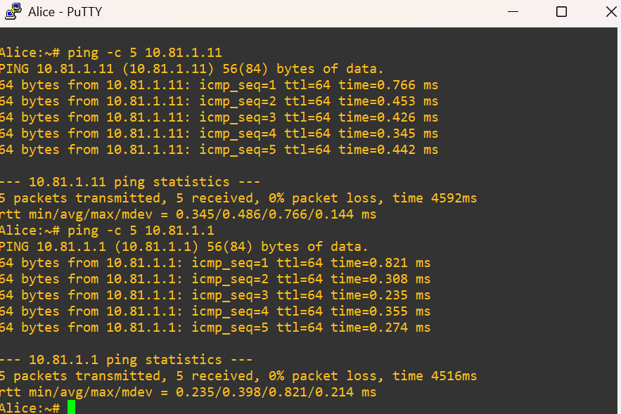

Mika to others
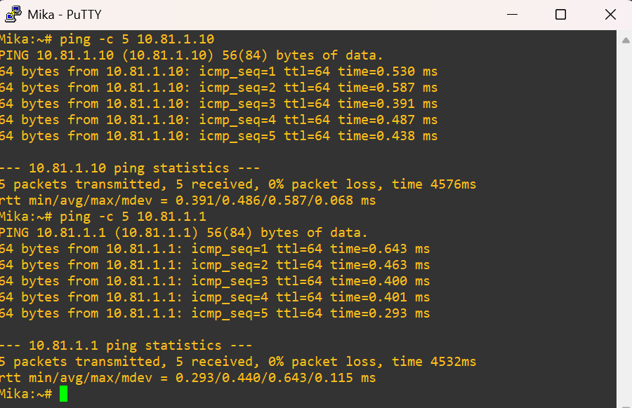

Chisa to others
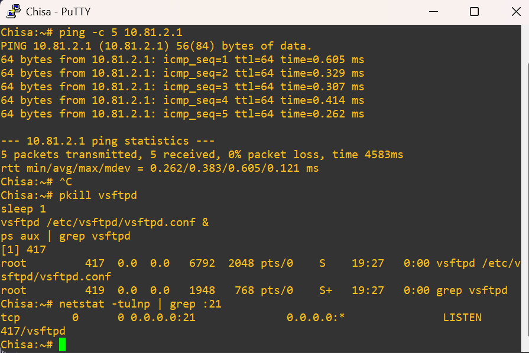

Knights to others
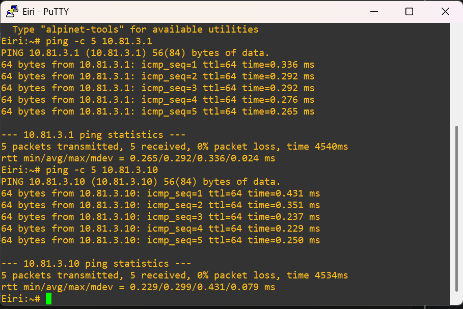

Eiri to others


## Soal_4
Lain ingin agar setiap Entitas (Client) memiliki kemandirian di The Wired. Konfigurasikan firewall/iptables (NAT Masquerade) dan DNS
resolver agar setiap Client dapat terhubung ke internet secara mandiri
(dapat melakukan ping ke 8.8.8.8 dan membuka domain web
google.com).

Agar client dapat ping ke 8.8.8.8 dan resolve domain google.com secara mandiri kita perlu mengecek file `/etc/resolve.conf`

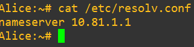

Resolving servernya adalah 10.81.1.1 maka IP ini akan ditambahkan ke masing masing client.

Selanjutnya kita mengecek apakah masing-masing client dapat terhubung ke internet atau tidak.

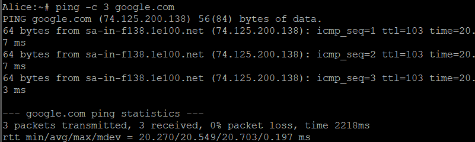
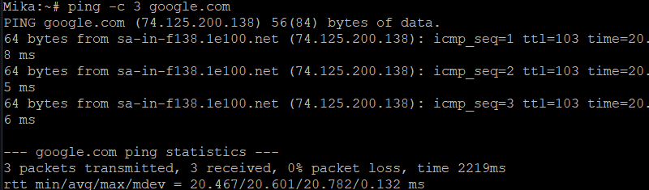
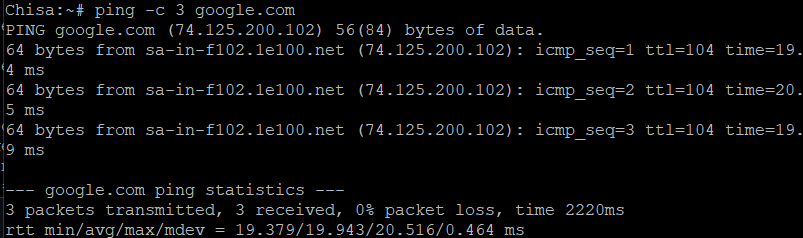
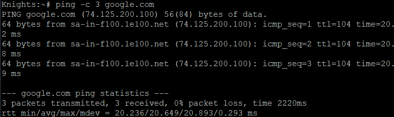
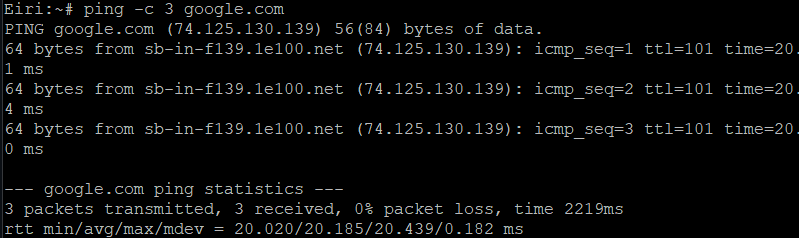

Jawabannya client dapat terhubung ke internet.

## Soal_5
Eiri tetap berupaya menanamkan kekacauan ke dalam jaringan. Untuk
mengantisipasi restart tiba-tiba, pastikan seluruh konfigurasi jaringan
tidak hilang saat semua node di-restart. Buat script verifikasi di
/root/cek_status.sh pada router Lain yang menampilkan ringkasan
interface (ip -br a) dan status tabel NAT (iptables -t nat -L -v -n)
setelah reboot.

Sebelum restart, pastikan RouterLain punya presistensi di /etc/network/interfaces.

```
auto eth0
iface eth0 inet dhcp
    up sysctl -w net.ipv4.ip_forward=1
    up iptables -t nat -A POSTROUTING -o eth0 -j MASQUERADE
    up iptables -A FORWARD -i eth1 -o eth0 -j ACCEPT
    up iptables -A FORWARD -i eth2 -o eth0 -j ACCEPT
    up iptables -A FORWARD -i eth3 -o eth0 -j ACCEPT
    up iptables -A FORWARD -i eth0 -m state --state ESTABLISHED,RELATED -j ACCEPT
    up dnsmasq -C /etc/dnsmasq.conf

auto eth1
iface eth1 inet static
    address 10.81.1.1
    netmask 255.255.255.0

auto eth2
iface eth2 inet static
    address 10.81.2.1
    netmask 255.255.255.0

auto eth3
iface eth3 inet static
    address 10.81.3.1
    netmask 255.255.255.0
```

Cek status_sh

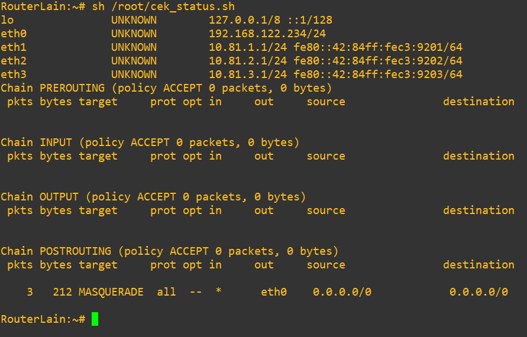

Lalu kita coba verivikasi pada client 

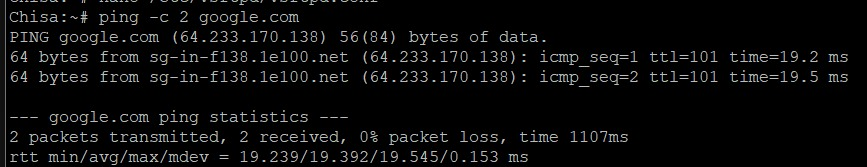

## Soal_6
Mika mencurigai adanya anomali traffic pada segmen jaringannya.
Jalankan generator traffic pada node Mika, lalu
lakukan packet sniffing menggunakan Wireshark pada interface node
Mika. Terapkan display filter khusus untuk menyaring paket yang
berprotokol DNS atau ICMP. Tunjukkan screenshot hasil filter beserta
ringkasan paket yang lolos.

Pertama, pada node Mika, kita perlu mendownload generator traffic dengan cara berikut.
```
wget https://drive.google.com/drive/folders/1ZjFvWIjvAQAjE9pPthm7V_bGyaSt93lY?usp=sharing
```
Jalankan file `traffic_protocol7.sh` yang sudah diunzip sebelumnya.
```
chmod +x traffic_protocol.sh
./traffic_protocol.sh
```
Tampilan ketika sudah berjalan:
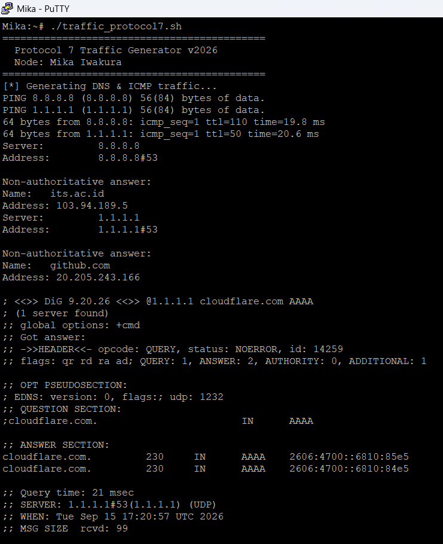

Kemudian, packet sniffing dilakukan dari kabel Mika dan Switch1 dengan menggunakan Wireshark.

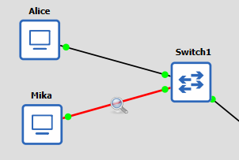

Selanjutnya, untuk menyaring paket yang berprotokol DNS atau ICMP, terapkan filter dengan mengisi `dns or icmp` pada kolom filter.

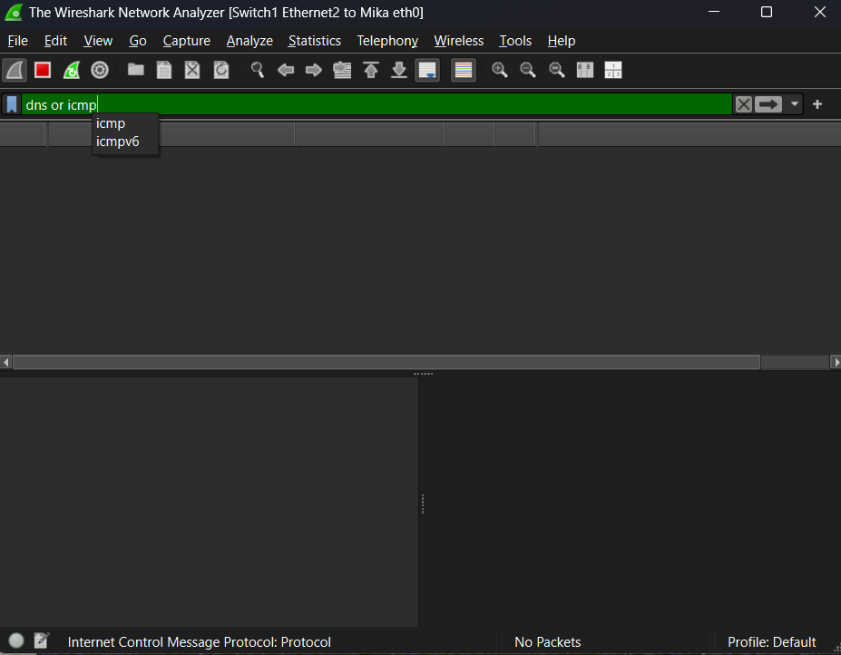

Tampilan ketika proses capturing dan ringkasan yang berhasil lolos.

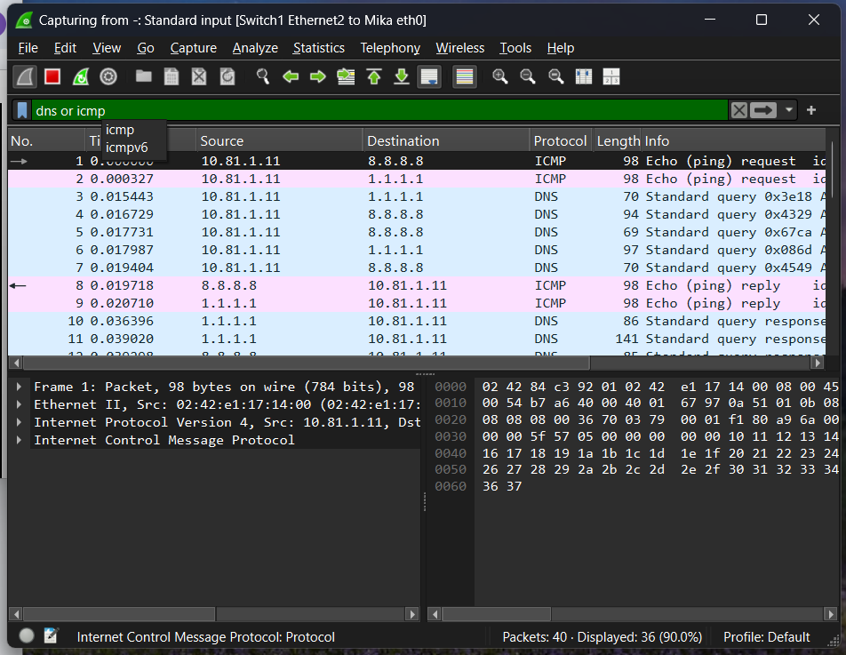

Hasil capture: [link](./captures/capture-eru-manwe.pcapng)

### Soal_7
Chisa memutuskan mendirikan FTP Server pada node miliknya dengan shared folder di /var/wired/data. Terapkan kebijakan akses: user alice (hak akses read & write), user mika (dibatasi read-only), dan user eiri (dibatasi tanpa izin akses / blacklist). Buktikan konfigurasi dengan membuat file signal_alice.txt dari user alice, dan buktikan penolakan akses saat user eiri mencoba login.

Untuk membuat FTP server pada node Chisa, kita perlu menginstall server package dengan `vsFTPd`
```
apk update
apk add vsftpd
```

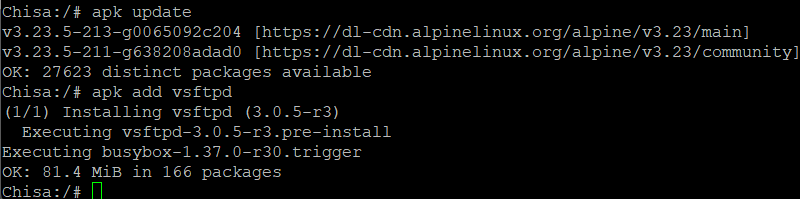

Selanjutnya, overwrite konfigurasi ke `/etc/vsftpd.conf` dilakukan dengan command berikut:
```
cat <<EOF > /etc/vsftpd.conf
anonymous_enable=NO
local_enable=YES
write_enable=YES
local_root=/var/wired/data
chroot_local_user=YES
allow_writeable_chroot=YES
user_config_dir=/etc/vsftpd_users
userlist_enable=YES
userlist_deny=YES
userlist_file=/etc/vsftpd.user_list
listen=YES
listen_ipv6=NO
pam_service_name=vsftpd
seccomp_sandbox=NO
EOF
```
Salah satunya adalah membuat aksesnya read/write ke folder FTP. Dan juga membuat config usernya menjadi folder based config yang diletakkan ke `/etc/vsftpd_users`.

Sebelum menerapkan akses, perlu untuk membuat user dan passwordnya terlebih dahulu. Karena user yang akan dibuat akses hanyalah client Alice, Mika, dan Eiri, maka cukup sebagai berikut.
```
adduser alice
adduser mika
adduser eiri
```
Password akan diminta setelah mendaftarkan user.

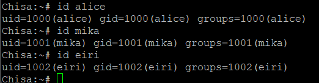

Untuk mengatur akses dari setiap client, digunakan command berikut.
```
mkdir -p /etc/vsftpd_users
cat <<EOF  > /etc/vsftpd_users/alice
write_enable=YES
download_enable=YES
dislist_enable=YES
EOF
```
```
mkdir -p /etc/vsftpd_users
cat <<EOF  > /etc/vsftpd_users/mika
write_enable=NO
download_enable=YES
dislist_enable=YES
EOF
```
```
echo "eiri" > /etc/vsftpd.user_list
```
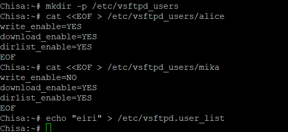

Kemudian, berikutnya adalah menjalankan FTP server vsftpd di background pada node Chisa.
```
vsftpd /etc/vsftpd/vsftpd.conf &
```
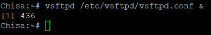

Maka, FTP server sudah berjalan di background dengan PID 436.

Nah, selanjutnya kita mencoba FTP ke node lain menggunakan client Alice. 
Command yang digunakan untuk login sebagai user alice adalah sebagai berikut.
```
lftp -u alice 10.81.2.10
```
`10.81.2.10` adalah IP dari target FTP server yaitu Chisa.

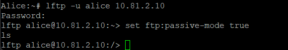

Command `set ftp:passive-mode true` di sini digunakan untuk mengaktifkan mode pasif pada koneksi FTP antara Alice dan Chisa agar proses transfer file dan pengambilan daftar file dapat berjalan dengan baik, di mana sebelumnya koneksi sering tidak terhubung (dalam mode active).

Selanjutnya adalah membuktikan konfigurasi pada user alice, kita membuat file `signal_alice.txt`. Pada lftp alice, command berikut dijalankan.
```
put signal_alice.txt
```
Dengan akses user alice dapat read/write, maka konfigurasi terbukti berhasil.

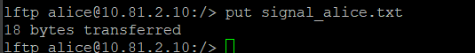

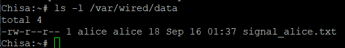

File berhasil dibuat oleh user alice.

Pembuktian selanjutnya pada user mika, yaitu read-only.
Melalui mika, kita login sebagai user mika
```
lftp -u mika 10.81.2.10
```
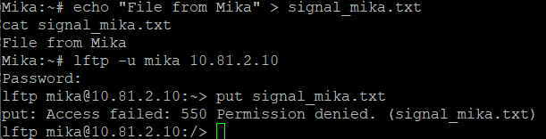

Dari gambar di atas, mika dapat melihat list directory, tetapi tidak bisa membuat file.

Pada user eiri, akses dibatasi (blacklist).
```
lftp -u eiri 10.81.2.10
```
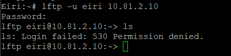

## Soal_8
Kelompok rahasia Knights perlu mengirimkan dokumen laporan
intelijen ke FTP Server Chisa. Lakukan koneksi FTP client dari node
Knights ke FTP Server Chisa menggunakan akun alice. Upload file
berikut (link file). Analisis sesi Wireshark dan sebutkan: perintah FTP
untuk upload (STOR), kode status sukses server (226), dan port data
TCP yang dinegosiasikan pada mode PASV.

Awal-awal kita perlu mendownload file zip pada link soal dengan cara.
```
wget knights.zip "https://drive.google.com/drive/folders/1tvZpueSH9E3GWwXM6KNnM64Y5wNoIAYP?usp=sharing"
lftp alice@10.81.2.10
```

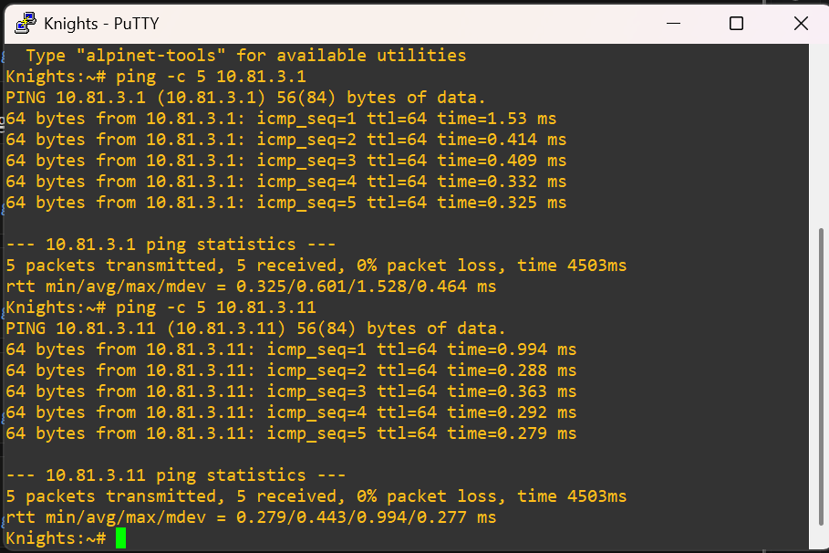

Selanjutnya kita melakukan capturing traffic dari kabel Knights dan Switch 3

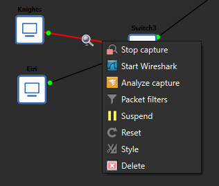

Bukti capturing

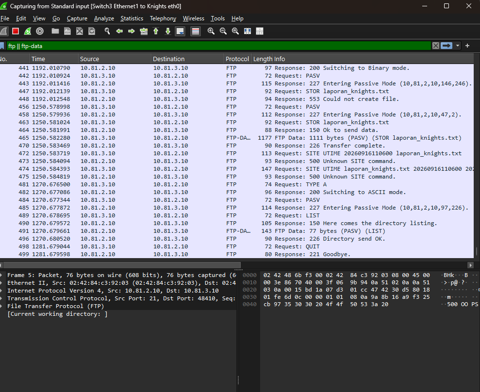

## Soal_9
Mika mengakses dokumen Protokol Tujuh di (link file) dari FTP Server
Chisa. Dari node Mika, unduh file tersebut menggunakan akun mika.
Setelah itu, buktikan pembatasan read-only dengan mencoba
mengunggah file baru dari akun mika, dan tunjukkan pesan error
respon server (error 550 Permission denied) saat mika mencoba
melakukan upload.

Pada awal kita mendownload protocol7_manifesto dari Chisa.

```
cd /shared
wget -O protocol7_manifesto.zip "https://drive.google.com/drive/folders/1S3hG0dnZBTkCta4uILWwKVc6dSYYGRJ6?usp=sharing" 
```

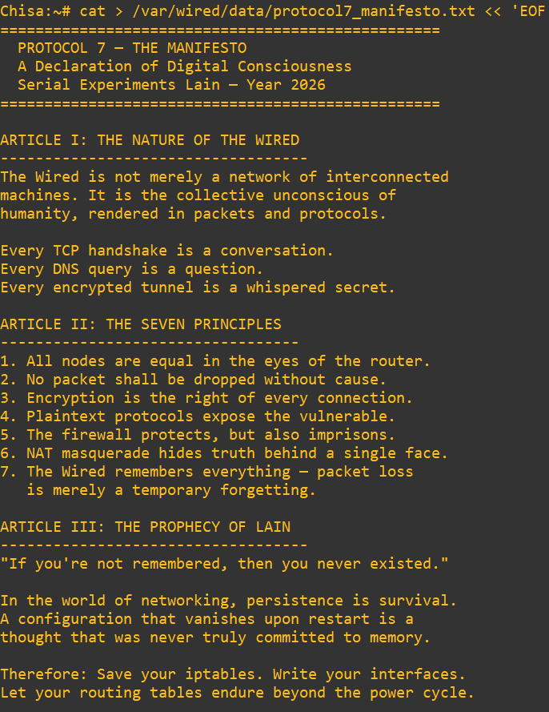

Selanjutnya kita melakukan capture pada Wireshark dan melakukan set filter di wireshark.

```
ftp || ftp-data
```

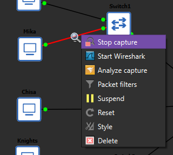

Pada node Mika kita butuh akses dokumen pada server Chisa.
```
lftp mika@10.81.2.10
```
Masukkan password yang sudah dibuat lalu ambil dokumen tersebut 

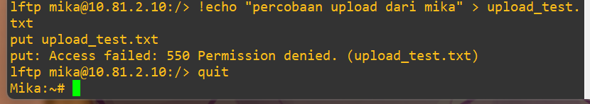

tunggu sampai selesai lalu cek di wireshark
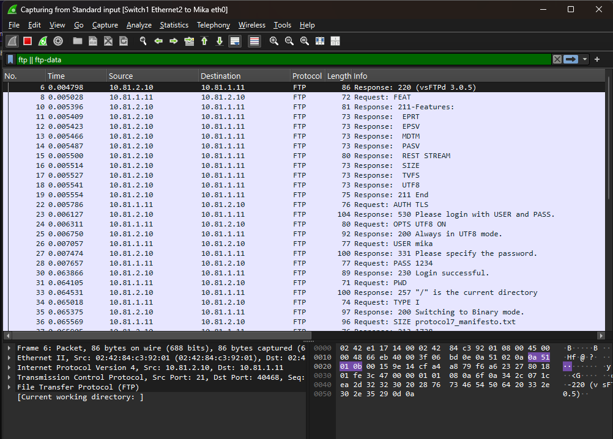

## Soal_10
Knights melancarkan uji ketahanan koneksi ke server Chisa untuk
menguji latensi jaringan The Wired. Kirimkan paket ping dari node
Knights ke node Chisa dengan payload khusus 128 bytes dan interval
0.3 detik sebanyak 77 paket (ping -c 77 -s 128 -i 0.3 <IP_Chisa>). Buka
Wireshark, catat nilai ICMP Type dan Code untuk Echo Request vs Echo
Reply, serta analisis packet loss dan RTT (min/avg/max).

Kita perlu mengirim ping dari node Knights ke node Chisa dengan ping.
```
ping -c 77 -s 128 -i 0.3 10.81.2.10
```

Penjelasan flag:

- c 77 → kirim 77 paket
- s 128 → ukuran payload 128 byte
- i 0.3 → interval 0.3 detik antar paket

Tunggu sampai selesai lalu cek di terminal dan wireshark.

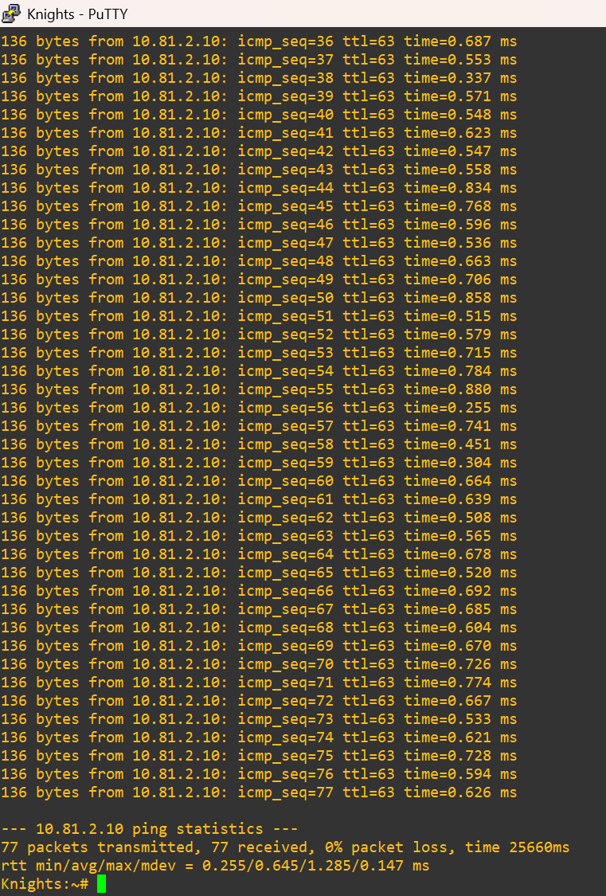
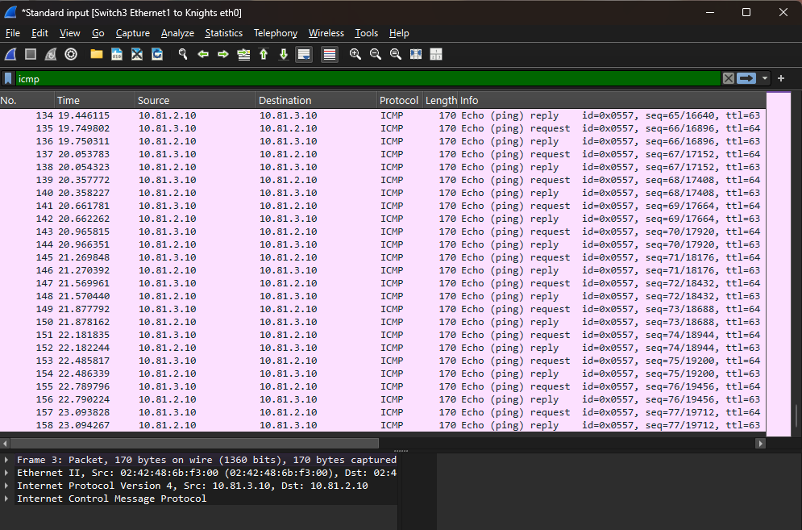

## Soal_11
Buktikan kelemahan protokol Telnet dengan membuat akun
phantom_user dan password wired_ghost pada layanan telnetd di
node Chisa. Lakukan login Telnet dari node Eiri ke node Chisa dan
tangkap sesi menggunakan Wireshark. Tunjukkan kredensial plain text
melalui fitur Follow TCP Stream, serta jelaskan mengapa setiap karakter
terkirim dalam paket TCP terpisah.

Sebelum membuktikan kelemahan protokol telnet, kita perlu meninstall beberapa setup service telnet untuk node Chisa.
```
apk add busybox-extras
telnetd -l /bin/login &
netstat -tlnp | grep 23
apk add net-tools
```

Selanjutnya tetap pada node Chisa kita buat akun phantom_user (pastikan username dan password sesuai intruksi).
```
adduser -D phantom_user
passwd phantom_user
```
pw: wired_ghost


Setelah pembuatan akun kita coba login telnet dari node Eiri dan mengetik command untuk memastikan bahwa kita sudah berada di akun phantom_user.

Bukti capture wireshark
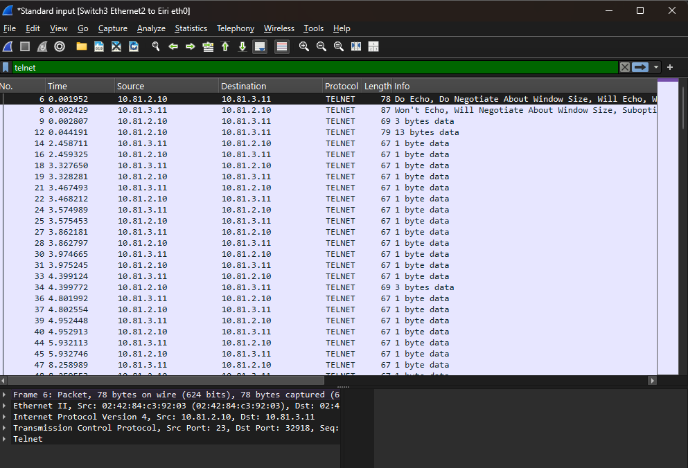

## Soal_12
Alice mencurigai Knights menjalankan beberapa layanan rahasia di
node-nya. Lakukan pemindaian port dari node Alice ke node Knights
menggunakan Netcat (nc) untuk memeriksa port 22 (SSH) dan 80
(HTTP) dalam keadaan terbuka, serta port rahasia 7777 dalam
keadaan tertutup. Analisis di Wireshark perbedaan TCP Flag yang
dikembalikan antara port terbuka (SYN-ACK) dengan port tertutup
(RST-ACK).

Sebelum melakukan pemindaian port dari node Alice ke node Knights menggunakan Netcat, dll. Kita perlu langkah awal.

```
//siapkan port SSH
apk add openssh

//jalankan servicenya
ssh-keygen -A
/usr/sbin/sshd

//cek jalan listen di port SSH
netstat -tlnp | grep :22
```

Setelah itu kita perlu siapkan HTTP di Knights
```
//jika belum install
apk add python3

python3 -m http.server 80 &

//cek jalan
netstat -tlnp | grep :80
```

Selanjutanya kita perlu melakukan scan port dari node Alice pakai Netcat. sebelumnya lakukan pengecekan apakah ada `nc` atau tidak jika tidak ada perlu install `apk add netcat-openbsd`

Setelah itu kita scan ketiga port
```
nc -zv -w 2 10.81.3.10 22
nc -zv -w 2 10.81.3.10 80
nc -zv -w 2 10.81.3.10 7777
```

- -z -> scan mode, hanya cek koneksi
- -v -> verbose, menampilkan hasil di terminal
- -w 2 -> timeout 2 detik per percobaan

Hasil di node akan langsung terlihat
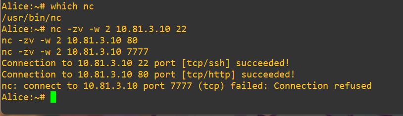

Hasil Analisis:

Perbedaan respons flag TCP menjadi dasar teknik *port scanning* untuk memetakan status layanan pada *host* target tanpa perlu membentuk koneksi penuh. Saat port terbuka (port 22 dan 80), *server* merespons paket **SYN** dengan **SYN-ACK** sebagai tahap kedua *TCP three-way handshake* untuk menandakan adanya layanan aktif yang siap menerima koneksi. Sebaliknya, jika port tertutup (port 7777) karena tidak ada layanan yang mendengarkan (*listening*), sistem operasi *server* akan menolak koneksi secara instan dengan mengirimkan paket **RST-ACK** (Reset-Acknowledge) untuk memutuskan sesi seketika.

## Soal_13
RouterLain memerintahkan agar administrasi jarak jauh menggunakan SSH
secara aman tanpa password. Install OpenSSH server pada node
Knights, buat pasangan kunci SSH (ssh-keygen) pada node Mika untuk
user mika_admin, dan konfigurasikan public key authentication
(PasswordAuthentication no). Lakukan koneksi SSH dari node Mika ke
node Knights, tangkap sesi menggunakan Wireshark, identifikasi paket
Protocol Version Exchange dan Key Exchange, serta jelaskan mengapa
kredensial tidak terlihat dalam bentuk teks terbuka seperti pada Telnet.

Sebelum membuat pasangan kunci SSH kita perlu melakukan isntalasi openssh pada node Knights.
```
apk add openssh
ssh-keygen -A
/usr/sbin/sshd

//lalu cek jalan
netstat -tlnp | grep :22
```

Selanjutnya pada node Knights juga kita perlu membuat user mika_admin.
```
adduser -D mika_admin

echo "mika_admin:dummy123" | chpasswd
```
Tidak perlu set password karena kita mau public key authentication, bukan password.

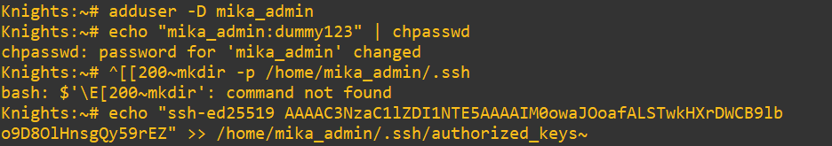

Pada saat cat /root/.ssh/id_ed25519.pub kita perlu menyalin `ssh-ed25519 AAAAC3NzaC1lZDI1NTE5AAAAIM0owaJOoafALSTwkHXrDWCB9lbo9D8OlHnsgQy59rEZ` ini merupakan key nya.


Lalu, pada node Mika kita buat pasangan kunci SSH
```
ssh-keygen -t ed25519
```
Saat diminta:

- File to save the key → tekan Enter saja (pakai default /root/.ssh/id_ed25519)

- Passphrase → tekan Enter (kosongkan, supaya login benar-benar tanpa input tambahan/password)

Lalu kita perlu cek hasilnya
```
ls -l /root/.ssh/
```

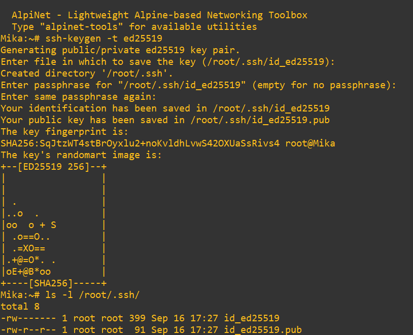

Terlihat bahwa kita berhasil membuat pasagan kunci SSH. Harus muncul id_ed25519 (private key) dan id_ed25519.pub (public key).

Selanjutnya, pindah ke node Knights lalu buat folder .ssh unuk mika_admin dan tempel key nya. Jangam lupa set permission. Juga mengganti konfigurasi PasswordAuthentication Yes menjadi No (Hapus # jika ada)
```
mkdir -p /home/mika_admin/.ssh
echo "ssh-ed25519 AAAAC3NzaC1lZDI1NTE5AAAAIM0owaJOoafALSTwkHXrDWCB9lbo9D8OlHnsgQy59rEZ" >> /home/mika_admin/.ssh/authorized_keys
```
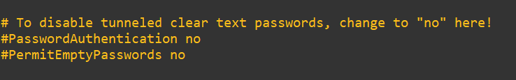

Kemudian kita cek apakah koneksi ssh kita berjalan dengan baik melalui node Mika

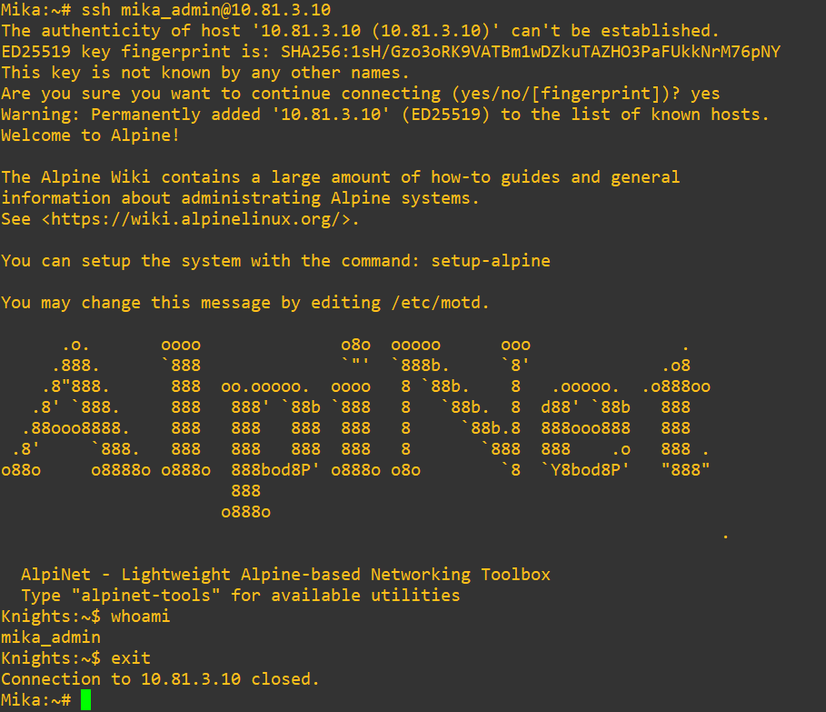

Saat login kita cek login ke ssh Mika dapat dilakukan untuk melakukan capture connection tersebut menggunkan wireshark.

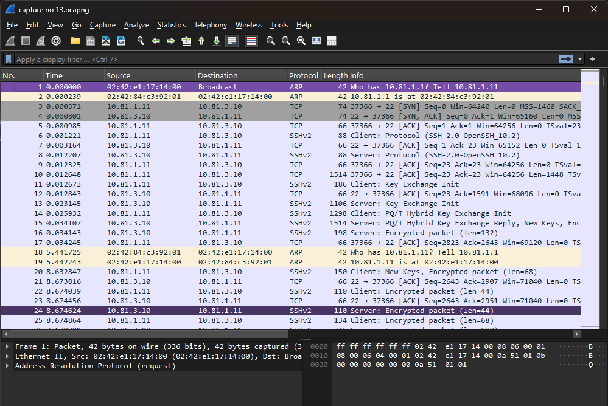

Pertanyaan:
Mengapa kredensial tidak terlihat dalam bentuk teks terbuka seperti pada Telnet?

Jawaban:
Berbeda dari Telnet yang mentransmisikan kredensial dalam bentuk *plaintext*, SSH menjamin keamanan kredensial karena proses autentikasi baru dilakukan setelah jalur enkripsi terbentuk melalui tahap *Key Exchange* (KEX). Menggunakan algoritma kriptografi asimetris seperti Diffie Hellman, *client* dan *server* menyepakati *shared secret key* tanpa pernah mentransmisikan kunci tersebut melalui jaringan. Lebih lanjut, autentikasi berbasis *public key* memanfaatkan mekanisme *challenge response*, sehingga *private key* tidak pernah dikirimkan. Alhasil, seluruh lalu lintas data termasuk kredensial terenkripsi secara total menggunakan *symmetric key*, membuat analisis paket di Wireshark hanya menampilkan data biner acak bertuliskan *"Encrypted Packet"*.

## Soal_14
14.Setelah gagal mengakses FTP, Eiri melancarkan serangan brute-force login | web Alice. wired_bruteforce.pcapng untuk mengidentifikasi alamat IP penyerang, target IP beserta port yang diserang, password user lain_admin yang berhasil ditembus, serta web server software dan versi yang dilaporkan pada response header. Validasi temuan kalian pada socket server: ([link file](./resources/soal14_wired_bruteforce.pcapng)) nc 10.4.89.247 3401

Analisis | file capture terhadap form

Filter `http`

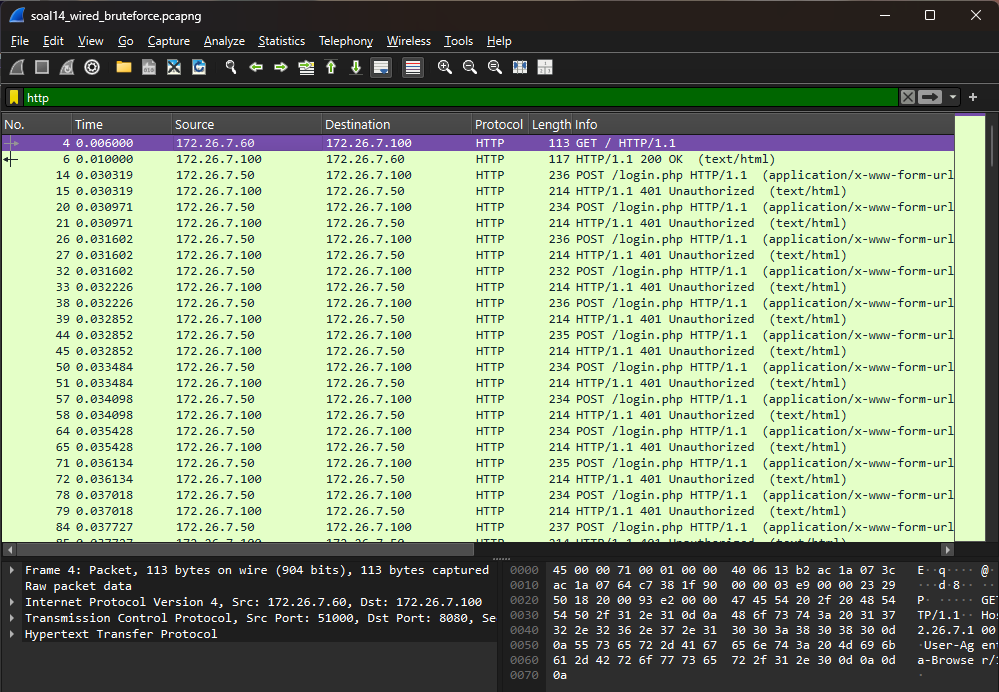

Ini untuk mencari paket-paket POST /login.php yang datang bertubi-tubi dari sumber yang sama.

Filter lebih spesifik `http.response.code == 200 && ip.addr == 172.26.7.100`

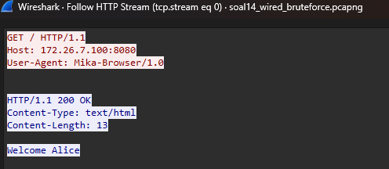

Hasil analisis
- Alamat IP penyerang : 172.26.7.50

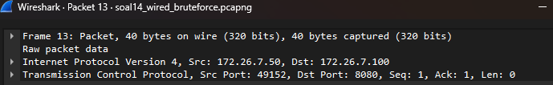

- Port penyerang : 172.26.7.100, port 8080

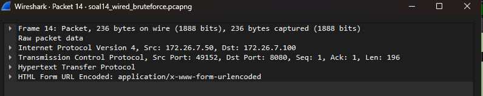

- User yang ditembus : lain_admin
- Password yang berhasil : wired_pr0tocol_7
- Web server software : Apache/2.4.62

Ini adalah bukti bahwa pertanyaan sudah terjawab dengan benar.

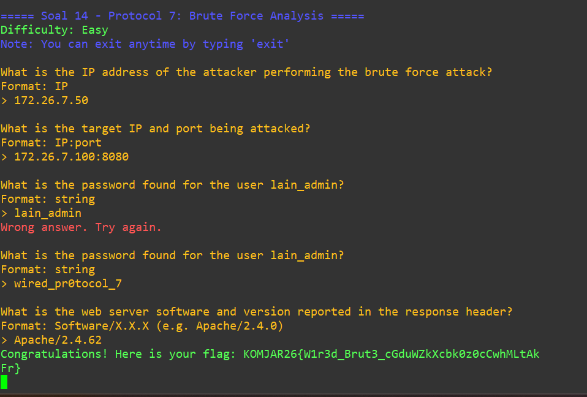

## Soal_15
Eiri menyusup ke ruang server dan memasang perangkat keyboard USB berbahaya pada node Alice. Buka file capture wired_usb_hid.pcap, identifikasi Vendor ID dan Product ID perangkat USB dari deskriptor USB, alamat nomor device USB, serta pesan rahasia yang berhasil dicuri dari keystroke. Validasi temuan pada socket server:
([link file](./resources/soal15_wired_usb_hid.pcap)) nc 10.4.89.247 3402 

Pertama, buka capture packet  `wired_usb_hid.pcap` di wireshark, kemudian untuk menemukan vendor ID dan product ID, kita bisa melihatnya pada dengan memasang filter:
`usb.bDescriptorType == 0x01`

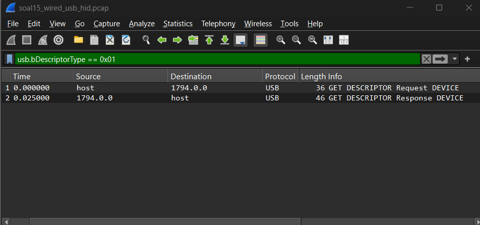

Pada device descriptor, kita dapat menemukan vendor ID dan product ID yang dicari.

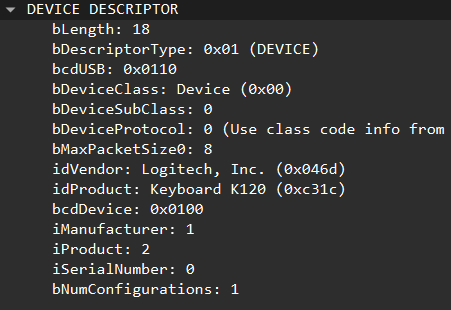

- Vendor ID: 0x046d
- Product ID: 0xc31c

Selanjutnya, untuk alamat nomor device USB, kita dapat menggunakan filter: `usb.device_address`

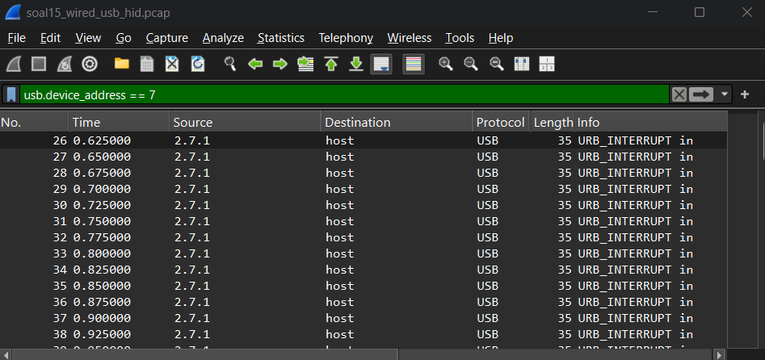

Maka, kita menemukan device address: 7

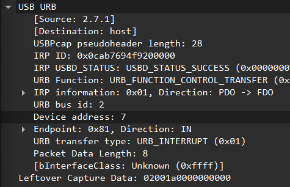

Untuk mendapat pesan rahasia, kita perlu menggunakan 

### Soal_16
Eiri meletakkan file malware di server. Dari file capture wired_ftp_theft.pcap, lakukan analisis lalu lintas FTP untuk mengidentifikasi alamat IP server FTP penyerang, banner software FTP yang digunakan, kredensial login penyerang, serta ukuran (size in bytes) dari file malware knights_payload.exe yang diunduh. Validasi temuan kalian pada socket server:
([link file](./resources/soal16_wired_ftp_theft.pcapng)) nc 10.4.89.247 3403 


### Soal_17
Alice membuat halaman web di node-nya. Eiri memanfaatkan celah untuk mengunduh payload berbahaya ke sistem Alice. Analisis file capture wired_http_c2.pcap untuk mengidentifikasi nama domain (Host) tempat malware diunduh, alamat IP server penyerang, nama file executable malware yang diunduh, serta kode status HTTP yang dikembalikan. Validasi temuan kalian pada socket server:
([link file](./resources/soal17_wired_http_c2.pcapng)) nc 10.4.89.247 3404

Identifikasi nama domain (Host) dan alamat IP server penyerang dengan menerapkan filter `dns`.

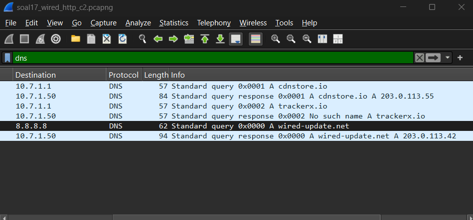

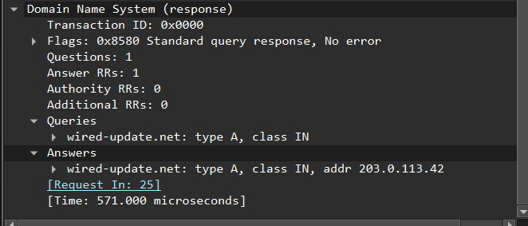

Nama domain (host): wired-update.net
Alamat IP server  : 203.0.113.42

Untuk menganalisis nama file dan kode status HTTP, filter yang digunkan adalah `HTTP`.

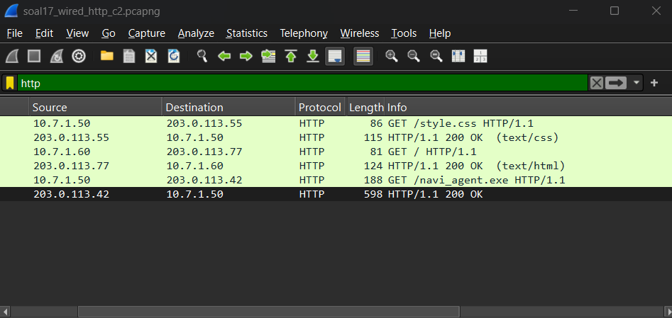

- Nama file malware: navi_agent.exe


- Kode status HTTP: 200

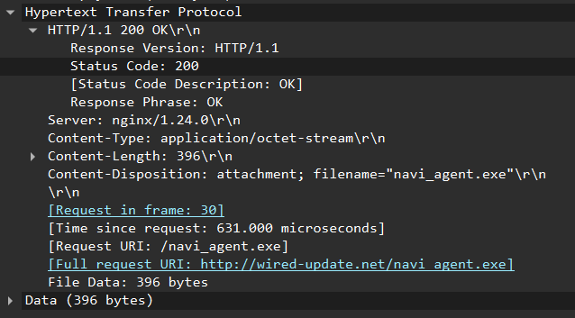

Ini adalah bukti bahwa pertanyaan sudah terjawab dengan benar.

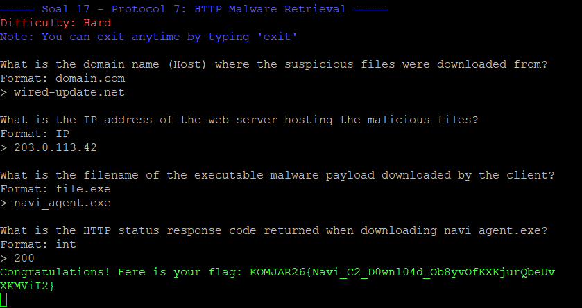

### Soal_18
Eiri mengubah taktik penyerangan dengan menanamkan file malware menggunakan protokol file sharing SMB. Analisis file capture wired_smb_transfer.pcapng untuk mengidentifikasi nama protokol jaringan yang dieksploitasi, IP pengirim dan penerima, folder tujuan penyimpanan malware pada sistem korban, serta nama file executable malware yang ditransfer. Validasi temuan kalian pada socket server:
([link file](./resources/soal18_wired_smb_transfer.pcapng)) nc 10.4.89.247 3405

### Soal_19
Eiri meneror jaringan dengan mengirimkan email pemerasan melalui protokol SMTP tanpa enkripsi. Analisis file capture wired_smtp_threat.pcap pada stream TCP terkait, identifikasi alamat email korban yang ditargetkan, password korban yang diklaim bocor oleh penyerang, jenis malware yang diinfeksikan, batas waktu (dalam hari) yang diberikan, serta MailClientID yang tercantum pada pesan. Validasi temuan kalian pada socket server: ([link file](./resources/soal19_wired_smtp_threat.pcapng)) nc 10.4.89.247 3406

Untuk mengidentifikasinya, kita dapat menerapkan filter `tcp.stream eq 6`

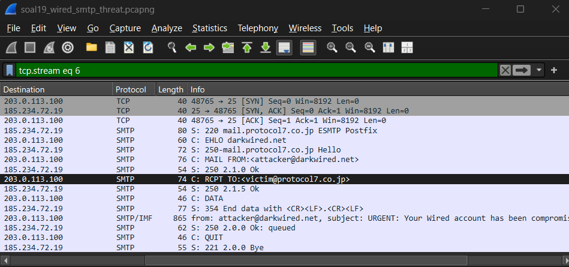
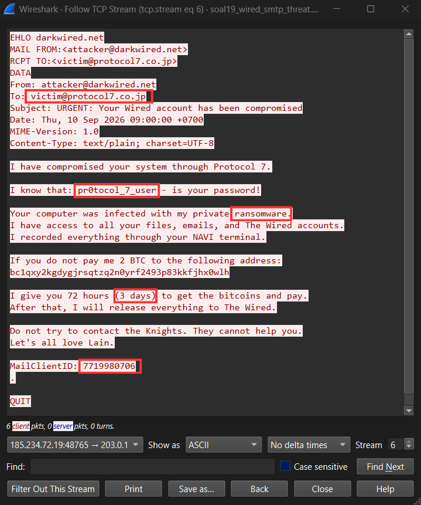

- Alamat email korban: victim@protocol7.co.jp
- Password korban    : pr0tocol_7_user
- Jenis malware      : ransomware
- Batas waktu (hari) : 3 hari
- MailClientID       : 7719980706

Ini adalah bukti bahwa pertanyaan sudah terjawab dengan benar.

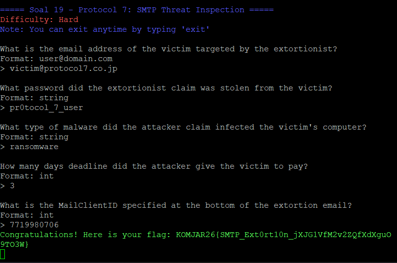

### Soal_20
Untuk rencana pamungkasnya, Eiri menyembunyikan komunikasi malware di balik saluran terenkripsi TLS. Namun Alice telah menyediakan file keylog untuk mendekripsi lalu lintas data tersebut. Analisis file capture wired_tls_decrypt.pcapng bersama keyslogfile.txt untuk mengidentifikasi versi protokol TLS yang dinegosiasikan, nama domain (SNI) yang diakses, alamat IP server HTTPS penyerang, User-Agent yang digunakan, serta HTTP request method dan path yang tersembunyi di dalam sesi dekripsi. Validasi temuan kalian pada socket server: ([link file](./resources/wired_tls_decrypt.pcapng)) nc 10.4.89.247 3407


